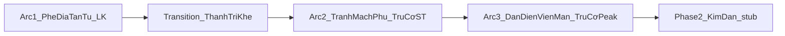

# Story spine — Phase 1 (Logic)

> **Work:** `tien-hiep-novel` · **Brief:** v2 · **Trần phase 1:** **Trúc Cơ kỳ đỉnh phong**  
> **Neo Foundation:** `foundation/core/01–03`, `foundation/logic/01-event-scale-system.md`

---

## 1. Cốt truyện một câu

**Tô Diêu**, tán tu tạp căn vùng nghèo khí, dùng trí và đa nghề sống sót giữa **Cường giả vi tôn** tầng thấp, mang theo vật lệch từ **Cửu Huyền Phế Trận**, từ **Luyện Khí** leo lên **Trúc Cơ Viên Mãn** — mỗi bước trả giá bằng linh thạch, khế, và lựa chọn **Hữu tình vs Vô tình** — trước khi phase 2 mở **Kim Đan** và quan hệ tình (NC trì hoãn).

---

## 2. Trục phase 1 ( không prose )

| Trục | Nội dung |
| --- | --- |
| **Ngoại** | Phế địa → thành trì → tranh mạch phụ → hội đan / Ma lậu vùng |
| **Nội** | Wound *“không đáng cứu”* → một lần cứu có giá → wound đâm (Arc 2) → quản lý chấp niệm trước Tâm ma (Arc 3) |
| **Cảnh giới** | LK 1→12 → Trúc Cơ Sơ–Trung → Trúc Cơ Hậu–**Đại Viên Mãn** |
| **Kinh tế** | Linh thạch hạ → tin bí cảnh = hàng → Trúc Cơ Đan monopoly → đan phương = chiến lợi phẩm |
| **Theme** | Nghịch Thiên / Thuận Thiên (lời nói xám); hành vi chính nghĩa ≠ phe; **không** heal wound sớm |

---

## 3. Dòng arc (xương sống đại cục)

| Khối | ID | Tên | Chương ước | Cảnh giới | Cliffhanger ra |
| --- | --- | --- | --- | --- | --- |
| **Arc 1** | `arc-1` | Phế Địa Tán Tu | **1–48** | LK 1→12 | Truy nã / vào **Thạch Lam Thành** |
| **Transition** | `arc-t` | Thành Trì Khế | **49–54** *(hoặc gộp 49–50 vào Arc 2)* | LK VM → chuẩn bị Trúc Cơ | Ký khế / vào tranh mạch |
| **Arc 2** | `arc-2` | Tranh Mạch Phụ | **55–88** *(band)* | Trúc Cơ Sơ–Trung | Ma lậu / Linh Dịch lệch |
| **Arc 3** | `arc-3` | Đan Điền Viên Mãn | **89–112** *(band)* | Trúc Cơ Hậu–VM | Tâm ma mầm; bí cảnh chung tin |

**Tổng phase 1:** ~**96–112** chương (mục tiêu brief **80–120**; rút bằng gộp Transition).

Chi tiết arc: [`arcs/00-arc-master-outline.md`](./arcs/00-arc-master-outline.md).

---

## 4. Chapter spine (điểm neo trước prose)

| Artifact | Path | Mức chi tiết |
| --- | --- | --- |
| **Phase 1 full table** | [`chapters/00-chapter-spine-phase1.md`](./chapters/00-chapter-spine-phase1.md) | Arc 1: **từng chương** (slug + tiêu đề làm việc); Arc T/2/3: **block** + dải ch |
| **Beat Arc 1** | [`arcs/01-arc1-beats.md`](./arcs/01-arc1-beats.md) | 10 beat ↔ dải ch |
| **Mục lục Interface** | [`../interface/chapters/00-index.md`](../interface/chapters/00-index.md) | Chỉ chương có file hoặc tiêu đề đã chốt |

**Trạng thái chương (spine):**

| Status | Nghĩa |
| --- | --- |
| `outline` | Có dòng spine; chưa prose |
| `draft` | Có file `.md` trong `interface/chapters/` |
| `review` | User/orchestrator duyệt |
| `canon` | Khóa; đổi Logic cần ticket |

---

## 5. Thứ tự công việc (orchestrator)

1. **Chốt / sửa** story spine + arc master (nếu đổi phạm vi).
2. **Mở rộng** chapter spine (Arc 2 từng chương khi sắp viết Arc 1 xong).
3. Beat + FS ledger **khớp** số chương spine.
4. Naming registry bổ sung theo arc block.
5. **Prose** theo `interface/chapters/00-index.md` — một chương một file `chapter-NN-slug.md`.

---

## 6. Phase 2+ (stub — không outline chương)

Kim Đan → Nguyên Anh / NC / phản diện §3.4 đầy đủ → phi thăng deferred. Không thêm dòng spine cho tới khi brief phase 2.

---

*Logic — project-orchestrator — 2026-09-07.*
